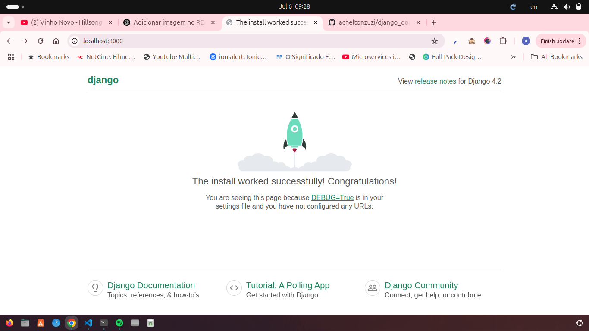

# Django with Docker

A simple example of how to set up Django in Docker.
## 🚀 Technologies Used

- [Python](https://www.python.org/)
- [Django](https://www.djangoproject.com/)
- [PostgreSQL](https://www.postgresql.org/)
- [Docker](https://www.docker.com/)

## ⚙️ How to Use

1. Clone the repository:
    ```bash
    git clone https://github.com/acheltonzuzi/django_docker.git
    cd django_docker
    cp .env.example .env
    ```

2. Start the containers:
    ```bash
    docker-compose up --build
    ```

3. Access the project at [http://localhost:8000](http://localhost:8000)

4. Create a new Django app:
    ```bash
    docker exec django_app python manage.py startapp jobs
    ```

5. Apply database migrations:
    ```bash
    docker exec django_app python manage.py migrate
    ```

6. Create a superuser for the admin site:
    ```bash
    docker exec -it django_app python manage.py createsuperuser
    ```

7. Collect static files (optional, for production):
    ```bash
    docker exec django_app python manage.py collectstatic
    ```

## 📄 Description

This project serves as a starting point for new Django projects, already configured for development with Docker and PostgreSQL database.
